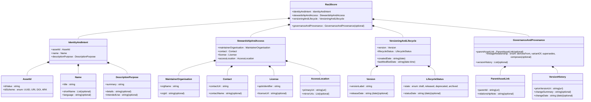

# RAS 3.0 UML Class Diagram

```mermaid
classDiagram

    class AccessLocation {
        +primaryUri : string (uri)
        +mirrorUris : List<string> (optional)
    }

    class AssetId {
        +idValue : string
        +idScheme : enum: UUID, URI, DOI, ARK
    }

    class Contact {
        +contactUri : string
        +contactName : string (optional)
    }

    class DescriptionPurpose {
        +summary : string
        +details : string (optional)
        +intendedUse : string (optional)
    }

    class GovernanceAndProvenance {
        +parentAssetLink : ParentAssetLink (optional)
        +lineageRelationship : enum: derivesFrom, variantOf, supersedes, composes (optional)
        +versionHistory : List<VersionHistory> (optional)
    }

    class IdentityAndIntent {
        +assetId : AssetId
        +name : Name
        +descriptionPurpose : DescriptionPurpose
    }

    class License {
        +spdxIdentifier : string
        +licenseUrl : string (optional)
    }

    class LifecycleStatus {
        +state : enum: draft, released, deprecated, archived
        +statusDate : string (date) (optional)
    }

    class MaintainerOrganisation {
        +orgName : string
        +orgId : string (optional)
    }

    class Name {
        +title : string
        +shortName : List<string> (optional)
        +language : string (optional)
    }

    class ParentAssetLink {
        +parentId : string (uri)
        +relationshipNote : string (optional)
    }

    class Ras30core {
        +identityAndIntent : IdentityAndIntent
        +stewardshipAndAccess : StewardshipAndAccess
        +versioningAndLifecycle : VersioningAndLifecycle
        +governanceAndProvenance : GovernanceAndProvenance (optional)
    }

    class StewardshipAndAccess {
        +maintainerOrganisation : MaintainerOrganisation
        +contact : Contact
        +license : License
        +accessLocation : AccessLocation
    }

    class Version {
        +versionLabel : string
        +releaseDate : string (date) (optional)
    }

    class VersionHistory {
        +priorVersionUri : string (uri)
        +changeSummary : string (optional)
        +changeDate : string (date) (optional)
    }

    class VersioningAndLifecycle {
        +version : Version
        +lifecycleStatus : LifecycleStatus
        +createdDate : string (date)
        +lastModifiedDate : string (date-time)
    }

    %% Relationships
    Ras30core *-- IdentityAndIntent
    IdentityAndIntent *-- AssetId
    IdentityAndIntent *-- Name
    IdentityAndIntent *-- DescriptionPurpose
    Ras30core *-- StewardshipAndAccess
    StewardshipAndAccess *-- MaintainerOrganisation
    StewardshipAndAccess *-- Contact
    StewardshipAndAccess *-- License
    StewardshipAndAccess *-- AccessLocation
    Ras30core *-- VersioningAndLifecycle
    VersioningAndLifecycle *-- Version
    VersioningAndLifecycle *-- LifecycleStatus
    Ras30core *-- GovernanceAndProvenance
    GovernanceAndProvenance *-- ParentAssetLink
    GovernanceAndProvenance *-- VersionHistory
```